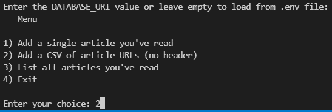

> For all avid readers of the New Yorker who, like me, can't remember what they've read: Provide single URLs of articles or a CSV of article URLs, and have article metadata like title, author(s), date published, rubric, tags and word count be read into a SQL database for querying.

### What?


### Why??

I read the New Yorker religiously and was always dissatisfied with the  Saved Articles section's inability to let me better query what I've read by tag, author, or rubric. So I wrote this little app to parse the HTML of articles I've read for key metadata and save these into a SQL database.

### How?

Clone this repo to your local disk.

Set up an empty, ideally web-hosted PostgreSQL database. There are many options but I'm using [ElephantSQL](https://www.elephantsql.com/)'s free tier for now. Copy your database's URI into the `.env` file in the root or enter it when prompted upon launching the app.

```
DATABASE_URI=[INSERT URI]
```
Make sure you have the following packages installed in your environment:

```bash
dependencies:
  - beautifulsoup>=4.9.3
  - pyscopg2>=2.9.1
  - tqdm>=4.62.3
```

Then, in your command prompt, cd (change directory) to the repo root and run

```bash
python app.py
```

In the menu, choose whether you want to (1) add the metadata to your database for a single article, (2) for multiple articles via the absolute path to a CSV of article URLs (no headers), or (3) list all articles currently in your database.



For (2) a progress bar is displayed.


### Known Issues/To-Dos

- tags for some types of articles cannot yet reliably be parsed or are not tagged
- duplicate articles are not automatically skipped
- there may be HTML patterns for author bylines which are not yet supported in which case an error with the respective URL is thrown - let me know!

### Acknowledgements

Check out Teclado's excellent [Complete Python/PostgreSQL Course 2.0](https://www.udemy.com/course/complete-python-postgresql-database-course/) on Udemy which inspired a significant chunk of the code base.